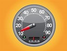

# Does Money Buy Happiness?

The short answer to this question is a `resounding` yes. The long answer? Well, let’s just say, **in a certain manner of speaking that money does indeed buy happiness**. **Happiness isn’t a commodity sitting on a store shelf**, so we can’t think of money as a product. **Happiness has been defined as a mere emotion**. Others have more elaborate definitions: a state of being, a state of mind, something that’s granted exclusively via a belief in a `deity`, etc.

> resounding adj.巨大的；令人瞩目的；响亮的；嘹亮的  
> deity n.神；上帝；女神；天主

Happiness is `elusive` in that **it’s hard to stay happy** and also in that **it’s hard to define what it is**. Happiness, to my mind, isn’t a state of being or mind; nor is it something bestowed on us by a deity we believe in. Happiness is `emergent` rather than fundamental, so it isn’t a thing in itself. It’s existence is `contingent` on at least one other thing, but in most cases, contingent on a number of factors that come together to make us happy.

> elusive adj.难找的；难以解释的；难以达到的difficult to find, catch, or achieve.  
> emergent adj.新兴的；处于发展初期的in the process of coming into being or becoming prominent. 这里的意思应该是说，Happiness是一个“衍生物”，而不是“本原物”，它是依附于别的东西上才产生的。  
> contingent adj.依情况而定的；

If you are in good health, have a stable career, food on your table, can pay your bills on time, and so on, you may be happy. Or not. You can have all of that and still find that you’re not happy because you want to be in a relationship or because you `covet` something else entirely, be it a promotion at work or a luxury item you can’t afford or something as simple as being able to move out of the bad neighborhood you currently live in. If happiness is `reducible` to **just one fundamental thing** in itself, I would say that **it’s reducible to and contingent on freedom**.

> covet v.觊觎；渴望；妄想(别人东西)  
> reducible adj.可以简化的 (of a subject or problem) capable of being simplified

People talk about specifically **financial freedom**. In that, they imply the freedom to do a `slew` of things: buy whatever they covet, travel wherever they want, afford a stay at any hotel, and so on. **So if happiness is contingent on freedom, then yes, money does buy happiness.** Speaking as someone who grew up poor and who is currently a middle class American, I can say without a doubt that I’d be happier if I were more `well off`. The reason for that is because I value my freedom. Let’s unpack the amount of freedom I’d have if I had financial freedom.

> 财务自由，是金钱（物质）的自由。

> slew n.大量；许多  
> well off adj.富有的；富裕的；境况良好

For one, I’d have **freedom to control my own time**. This is absolutely crucial for me and is usually the source of my frustration and unhappiness. There’s just not enough time! What kind of time? Well, personal time in particular is the kind of time I speak of. I find myself working, even on weekends. I have little time to myself and my time is often allocated more heavily toward other people and their needs.

> 时间自由

I’d also **be free to control my own space**. This, again, is `pivotal`. I’m an `ambivert`, so once my social `meter` `plummet`s, I need my own space. I find a lot of comfort in `solitude`. I genuinely enjoy being alone at times. I am most effective in my writing when I’m alone, when there’s nothing but the sound of my own breathing. I can also use personal space to read or to do `intensive` research.

> 拥有独自空间的自由

> pivotal adj.关键性的；核心的  
> ambivert n.【心】具有合乎内向和外向之间性格的人；具有中向性格的人  
> meter n.表；仪；计；计量表。 另外，它也表示距离单位“米”。

> plummet v.暴跌；速降fall or drop straight down at high speed.  
> solitude n.独处；独居the state or situation of being alone.  
> intensive adj.短时间内集中紧张进行的；密集的；彻底的；十分细致的 concentrated on a single subject or into a short time; very thorough or vigorous.

`Determinism` aside, I’d also have, at the very least, the appearance of freedom of choice. With x amount of millions of dollars in my bank account, the destinations are boundless. I can go to Punta Cana, Cancun, Paris, Sydney, Prague, Budapest, London, Madrid, Belfast, or anywhere else. I can visit any known monument, any of the eight wonders of the world, and anyone I may know outside of New York City. I can go by plane, by cruise, by train, by bus, or by car. I’d be free to leave however I please and whenever I please.

> 选择的自由

> determinism n.【哲】决定论；宿命论（排除自由意志，认为个性或行为均由环境和自己不能控制的因素所决定）the belief that people are not free to choose what they are like or how they behave, because these things are decided by their surroundings and other things over which they have no control

**Financial freedom** really is just a way of `consolidating` freedom of **time**, of **space**, and of **choice**. Money can certainly buy you that kind of freedom. At my current job, I have time constraints. I have to be somewhere at a given time and that’s that. There’s always someone to answer to. If I had financial freedom, I wouldn’t be bound to any such commitments, i.e. I would be my own boss.

> 财务自由，有助于 时间自由、拥有独处空间的自由 和 选择的自由

> consolidate v.加固；巩固

Money can certainly buy happiness, but perhaps the answer is a `subjective` one. Money can buy my happiness given my drawn out explanation here. If you value different things, then money may not buy your happiness. I happen to think that the answer isn’t subjective though. **Unhappiness is always tied to time, space, or choice**. It also doesn’t matter where a person finds themselves in the world; you can be American, French, Chinese, South African, or what have you. If you’re unhappy, it’s because you want to be somewhere other than where you are: you hate your job; you hate your `abusive` stepfather or significant other; you don’t like your neighborhood; you don’t like your country. Or, you want to do something else with your time: you want to sleep more; you want to spend time with people other than the people you find yourself with at the moment; you don’t want to be stuck at your job for eight hours; you don’t want to be in class for seven or eight hours. Or, you want more choices: you’re tired of eating the same things; you’re tired of being in the same city; you’re tired of not being able to afford a fancier vacation.

> subjective adj.主观的（非客观的）based on your own ideas or opinions rather than facts and therefore sometimes unfair  
> abusive adj.辱骂的；恶语的；毁谤的；虐待的rude and offensive; criticizing rudely and unfairly

The poorest people on the planet **don’t want** to live in the underdeveloped parts of their country. They **don’t want** to live in a shelter with broken, leaky ceilings. They **don’t want** be confined to the same space. They **don’t want** to be stuck in that same situation all the time. They **want** to be able to make better choices for themselves and their families. Humans have this in common and this is arguably why religion is so prevalent: the promise of eternity, be it heaven or reincarnation or whatever afterlife concept you can think of. What **everyone** seems to **want** is **freedom**. We all want **freedom** to do what we want and when we want, and we want full access to every choice imaginable in every market we can think of, whether that be food, clothing, shelter, cars, or other commodities.

> 每个人都想有好事，但有没有好事，还是得看各人的因缘。  
> 信仰，即是让一个人摆脱如此不自由的状态。如果一个人只是向外驰求，总也不会如意。只有向内去求，才能解脱束缚，得到真正的自由。

Or is there something you value more than freedom? If so, can you not buy that with money?

> 金钱，只能买有形的物质，同时，也并不是所有有形的物质都能买到。另外，更多的东西其实是无形的。

One last thing! I definitely don’t mean to exclude anyone who is disabled (mentally or physically) nor anyone who has a debilitating illness. But at the end of the day, I think such individuals want freedom too. Money definitely can’t buy a clean bill of health in all cases. I can remove a few wisdom teeth causing me pain, but if the cancer is too advanced, removing any tumors wouldn’t help me at all. Money can buy happiness if one is healthy enough to fully enjoy their freedom. That’s the thing about retirement eh!? That’s another story though!

> 当金钱成为制约因素的时候，你有了足够的钱，的确可以解决问题，这是正向的一面。另一面，当金钱不是关键性因素的时候，再多，可能也无济于事。
