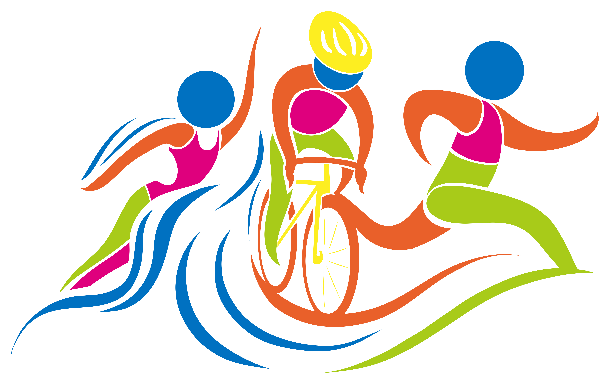

# goal-task-plan

## What is the difference between a dream, a goal and, a plan?

A dream is a goal without a plan. A goal is a dream broken down into actionable discrete steps. And goals are the stepping stones you touch to reach your dreams.

> dream->goal->task->plan  
> dream，就是一个最初的想法、愿望，是一个定性的描述；  
> goal，是将dream进行具象化，每个方面达到一个什么样的要求，是一个定性的描述；  
> task，和goal是一个相互转换的概念；  
> plan，是从时间的维度考虑task。

## Happy Monday!

Since you’re starting a new week, you are probably setting **a few short-term goals**.

Are you sure they are a goal?

It’s easy to get caught up in life and confuse the tasks you need to do with goals – but there is a difference.

- (1) Goals contain your outcome and why you desire them.
- (2) Your passion for a goal turns into reality when you begin achieving your list of tasks.（道虽迩，不行不至；事虽小，不为不成。）
- (3) If your tasks do not align directly with you goals, you will not reach your goal. That’s called a distraction.（分心，分散用心，目标难成）
- (4) When you complete your goal aligned tasks, you move closer to your stated outcome.（专心，专一用心，成功有望）

Not all tasks lead to goals, but all goals lead to tasks.

> 所谓“非志无以成学”，其中“志”就是目标和方向。

Stay focused.

> 保持专注

## goal VS task

A **goal** is a large thing you wish to achieve, such as "to complete a Triathlon." A **task** is a small item that you do to achieve that goal, such as "run 3 miles."

> A goal is a large thing you wish to achieve.  
> A task is a small item that you do to achieve that goal.

> Triathlon [traɪˈæθlən] 铁人三项；三项全能运动a sporting event in which people compete in three different sports, usually swimming, cycling and running  

Some time People confuse between **goals** and **tasks**. Both of them are targets you need to reach in the future. You determine your goal and tasks for specific reason and for that you can identify the tasks as small goals done to reach bigger goal and the goal is one big task.

> task和goal并不绝对，而是一个相对的概念，能够相互转换。

For example : if your Goal is to achieve specific budget for your company you have to do many tasks to achieve that goal as marketing product, enhancing service improvement and so on. Each task of the above is a goal itself and you had to do smaller task to achieve it and in the end if you achieve your bigger goal and achieve the budget you will find out that it was a task to reach bigger goal i.e.: expanding or to conquer another market ect..

> 此处是举例，来说明：task和goal，在不同的场景下，是可以相互转换的。

We are less emotionally invested in a task: we probably don't want to perform that task for its own sake. And if **there is another way to achieve that same goal, using different tasks**, we may be happy to do that, dropping the original task altogether. As long as we get to the goal (and don't violate other goals) we're happy.

> 但是，goal和task之间并不是绑定的关系。为了实现同样一个goal，我们可以选择完成这些tasks，也可以选择完成那些tasks。

Tasks should be small and achievable. A goal is reached through a series of tasks.

## Task

Often we're more effective when focussed on a single thing.

> 在实现Task的过程当中，保持专一，能够让我们有更高的效率。

## TODO

- [ ] goal是可以度量的。如果没有办法度量，就无法知道是否已经完成了。

Goals (YES)

- Increase sales by 10%
- Reduce customer turnover by 15%
- Launch five new products this year
- Cut production waste by 20%

